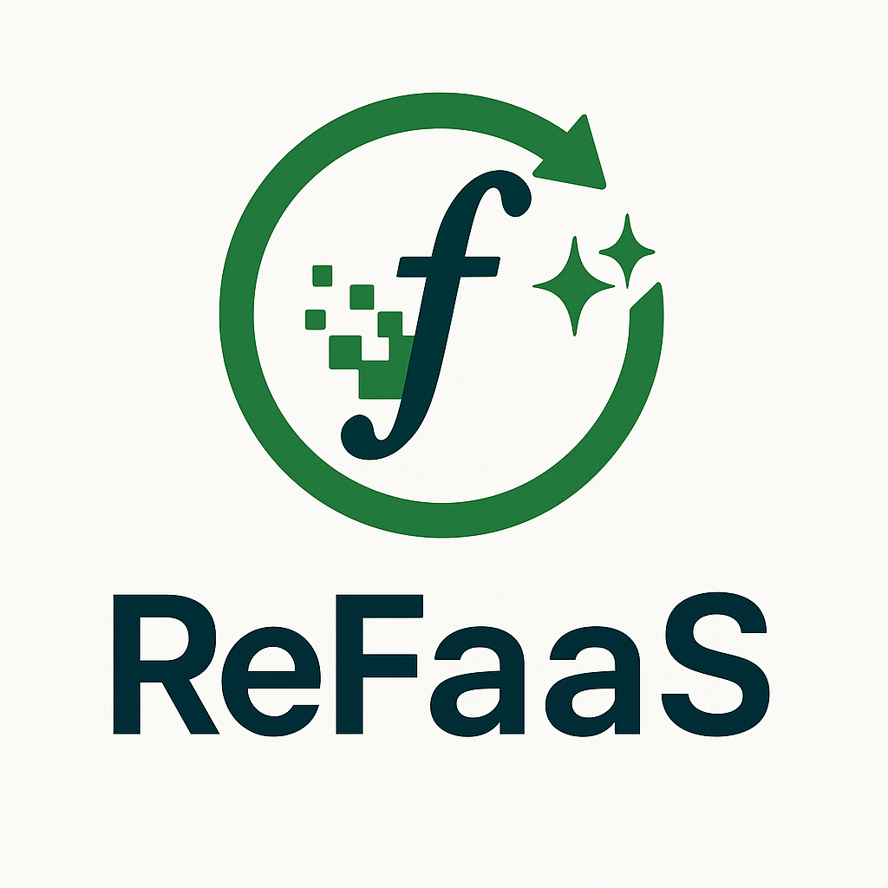

<div id="top">

<!-- HEADER STYLE: CLASSIC -->
<div align="center">




<em>A service for rewriting FaaS Functions into more energy efficient versions.</em>

<!-- BADGES -->
<em>Built with the tools and technologies:</em>


</div>
<br>

---

## Table of Contents

- [Table of Contents](#table-of-contents)
- [Overview](#overview)
  - [Pipeline Overview](#pipeline-overview)
  - [📚 API Endpoints](#-api-endpoints)
  - [📦 Data Structures](#-data-structures)
      - [ConversionRequest](#conversionrequest)
      - [ConverterOptions](#converteroptions)
    - [PipelineFile](#pipelinefile)
  - [⚡ Additional Notes](#-additional-notes)
- [Getting Started](#getting-started)
  - [Prerequisites](#prerequisites)
  - [Usage](#usage)
  - [🧪 Example Usage](#-example-usage)
    - [1. Upload a File](#1-upload-a-file)
    - [2. Check if a Job Exists](#2-check-if-a-job-exists)
    - [3. Download the Converted Package](#3-download-the-converted-package)
    - [4. Retrieve All Metrics](#4-retrieve-all-metrics)
    - [5. Reconfigure the Pipeline](#5-reconfigure-the-pipeline)

---

## Overview

The ReFaaS transforms serverless functions from one language to another (e.g., Python → Go) using a configurable AI-assisted pipeline. Upload a `.zip` file, and retrieve the converted package once processing is complete.

---

### Pipeline Overview
The conversion pipeline consists of several tasks, each with its own retry logic and validation steps. The tasks are executed in a sequence or conditionally based on the results of previous tasks.

An example pipeline configuration is provided in the [Example Usage](#5-reconfigure-the-pipeline) section and in the following figure.

<center>


</center>

For more details check out the source code in the [pipeline.go](./pipeline.go) file and for predefined tasks look into [types.go](./types.go).

### 📚 API Endpoints

| Endpoint | Method | Request | Response | Description |
|:---|:---|:---|:---|:---|
| `/` | POST | Multipart form with field `file` (`.zip`, max 50MB) | `201 Created` + Redirect to `/{uuid}`<br/>Errors: `400`, `415`, `500` | Upload a serverless function `.zip` for conversion. |
| `/{uuid}` | HEAD | - | `200 OK` if job exists<br/>`404 Not Found` if job unknown | Check if a submitted conversion job exists. |
| `/{uuid}` | GET | - | `200 OK` + Converted `.zip` file if completed<br/>`406 Not Acceptable` if not completed<br/>`404 Not Found` if unknown<br/>`500 Internal Server Error` on error | Download the converted serverless function package by UUID. |
| `/metrics` | GET | - | `200 OK` + JSON with metrics | Retrieve conversion processing metrics for all jobs. |
| `/reconfigure` | POST | JSON body with `ConverterOptions` | `201 Created` on success<br/>`500 Internal Server Error` on failure | Reconfigure the conversion pipeline at runtime. |

---

### 📦 Data Structures

##### ConversionRequest
```json
{
  "id": "string (UUID)",
  "sourcePackage": "DeploymentPackage (optional)",
  "workingPackage": "DeploymentPackage (optional)",
  "metrics": "Metrics (optional)",
  "completed": "boolean"
}
```

##### ConverterOptions
```json
{
  "pipeline": "PipelineFile (optional)",
  "LLMClient": "string",
  "args": { "key": "value" }
}
```


#### PipelineFile
Defines a sequence of tasks for the conversion pipeline.

```json
{
  "options": {
    "model_name": "string",
    "strategy": "string",
    "temperature": "float",
    "top_p": "float",
    "num_ctx": "integer"
  },
  "tasks": [
    {
      "id": "string",
      "task": "string",
      "task_args": { "key": "value" },
      "maxRetryCount": "integer",
      "validation": "string",
      "canApply": "string",
      "recovery": "string",
      "next": ["string"]
    }
  ]
}
```

**Key Elements:**
- `options`: Settings for the LLM model and inference behavior.
- `tasks`: A list of tasks executed sequentially or conditionally, each with retry logic, validation, and recovery tasks.

---

### ⚡ Additional Notes

- **Upload size limit**: Maximum 50MB file size.
- **Accepted format**: Only `.zip` files.
- **Job expiration**: Jobs are deleted **after download** or **server restart**.
- **Concurrency**: A background worker sequentially processes uploaded jobs.
- **Pipeline Config**: The service supports **dynamic reconfiguration** without restarting.

---

## Getting Started

### Prerequisites

This project requires the following dependencies:

- **Programming Language:** Go
- **Package Manager:** Go modules

### Usage

Run the project with:

**Using [go modules](https://golang.org/):**
```sh
go run .
```

This will start the service running on port 8080. However, for isolation, it is recommended to run the service in a Docker container, see [Docker](#docker) for more details.

**🛠️ Environment Variables**

| Variable | Default | Description |
|:---|:---|:---|
| `OLLAMA_API_URL` | Internal default (`OLLAMA_API_URL`) | URL for connecting to Ollama LLM API. |
| `GEMINI_API_KEY` | `"NOT+SET"` | API key for Gemini LLM (optional if not using Gemini backend). |

---


### 🧪 Example Usage

#### 1. Upload a File
```bash
curl -F 'file=@path/to/your_function.zip' http://localhost:8080/
```
- On success, will redirect (`201 Created`) to `/UUID` for the submitted job.

---

#### 2. Check if a Job Exists
```bash
curl -I http://localhost:8080/<job-uuid>
```
- HTTP `200 OK`: Job exists
- HTTP `404 Not Found`: No such job

---

#### 3. Download the Converted Package
```bash
curl -O http://localhost:8080/<job-uuid>
```
- Downloads a `.zip` file if the job is completed.

---

#### 4. Retrieve All Metrics
```bash
curl http://localhost:8080/metrics
```
- Returns a JSON object with timing and issue metrics for each job.

---

#### 5. Reconfigure the Pipeline

```bash
curl -X POST -H "Content-Type: application/json" -d '{
  "LLMClient": "ollama",
  "args": {
    "OLLAMA_API_URL": "http://your-ollama-instance:11434"
  },
  "pipeline": {
    "options": {
      "model_name": "qwen2.5-coder:32b",
      "strategy": "json",
      "temperature": 0.1,
      "top_p": 0.8,
      "num_ctx": 32768
    },
    "tasks": [
      {
        "id": "root",
        "task": "cleaner",
        "maxRetryCount": 2,
        "next": ["convert"],
        "validation": "canCompile"
      },
      {
        "id": "convert",
        "task": "coder",
        "task_args": {"reader": "go"},
        "maxRetryCount": 2,
        "validation": "canCompile",
        "next": ["builder"]
      },
      {
        "id": "builder",
        "task": "goBuilder",
        "canApply": "canCompile",
        "recovery": "gollmReovery",
        "maxRetryCount": 4,
        "next": ["goTester"]
      },
      {
        "id": "gollmReovery",
        "task": "fixer",
        "canApply": "canCompile",
        "task_args": {"reader": "go"},
        "maxRetryCount": 6
      },
      {
        "id": "goTester",
        "task": "goTester",
        "canApply": "canCompile",
        "maxRetryCount": 5,
        "recovery": "testRecovery"
      },
      {
        "id": "testRecovery",
        "task": "realign",
        "canApply": "canCompile",
        "task_args": {"reader": "go"},
        "maxRetryCount": 3,
        "next": ["testRecoveryBuild"]
      },
      {
        "id": "testRecoveryBuild",
        "canApply": "canCompile",
        "task": "goBuilder",
        "recovery": "gollmReovery",
        "maxRetryCount": 3
      }
    ]
  }
}' http://localhost:8080/reconfigure
```
- Updates the pipeline configuration at runtime.
- Clears all previously submitted jobs and metrics!

<!-- ## License

 is protected under the [LICENSE](https://choosealicense.com/licenses) License. For more details, refer to the [LICENSE](https://choosealicense.com/licenses/) file. -->

<div align="right">

[![][back-to-top]](#top)

</div>

[back-to-top]: https://img.shields.io/badge/-BACK_TO_TOP-151515?style=flat-square